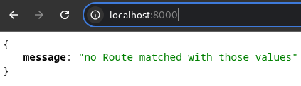
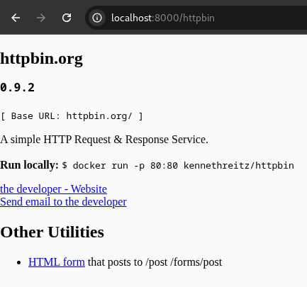
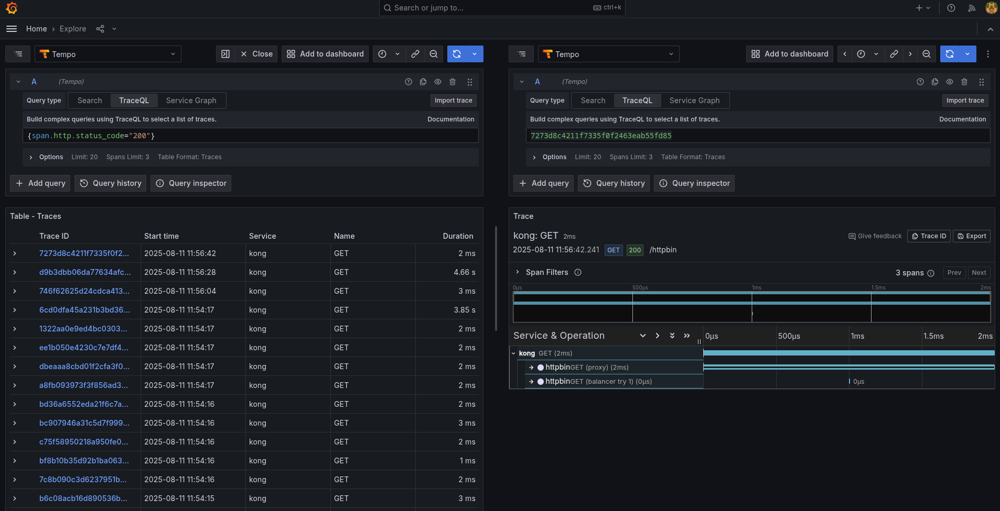

# Kong with Zipkin Plugin and Grafana Tempo (Docker Compose)

This repository contains a **Kong 2.4** setup configured with the **Zipkin plugin** to export API request traces from Kong to **Grafana Tempo** for distributed tracing visualization.

The entire project runs in **Docker Compose**, making it easy to spin up a local environment for testing and development.

---

## 📌 Features

- **Kong 2.4** as the API Gateway
- **Zipkin plugin** enabled to send traces
- **kong/httpbin** as default backend
- **Grafana Tempo** for trace storage
- **Grafana** for visualization
- Fully containerized setup with **Docker Compose**
- Ready-to-use local environment

---

## 📂 Project Structure

```text
.
├── docker-compose.yml
├── kong/
│   └── kong.yml
├── grafana/
│   └── tempo.yaml
│   └── datasource.yaml
└── README.md
```

## 🚀 Running Locally

```bash
docker-compose up -d
```

### Kong

You can access Kong through the following URL:  
```http://localhost:8000/```



Now, let’s test a valid route within Kong:  
```http://localhost:8000/httpbin```

  

As you can see, the request is working successfully!

---

### Tracings

Next, open Grafana by navigating to:  
```http://localhost:3000```

In the **Explore** tab, you will already be able to find the traces:

